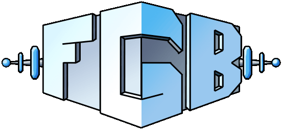
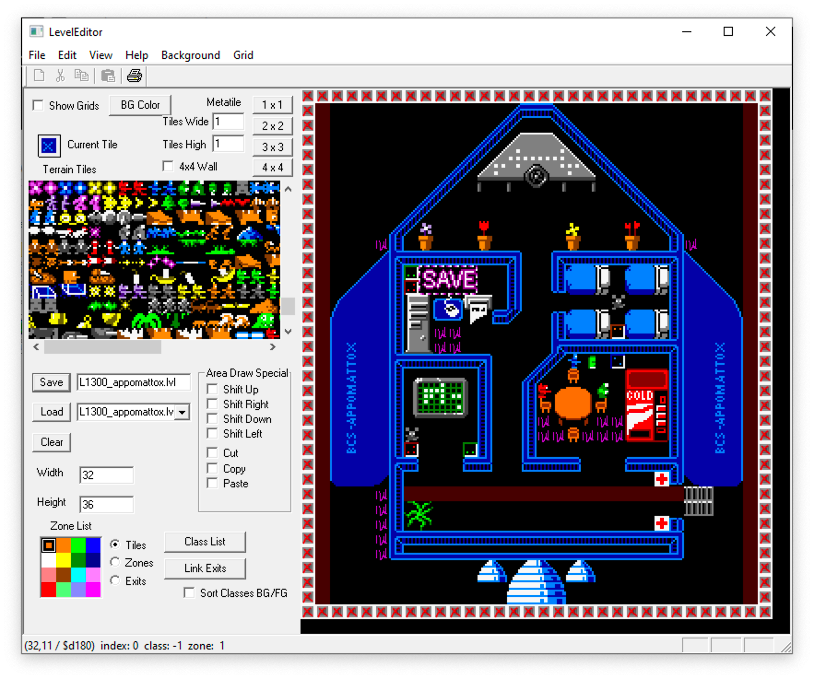
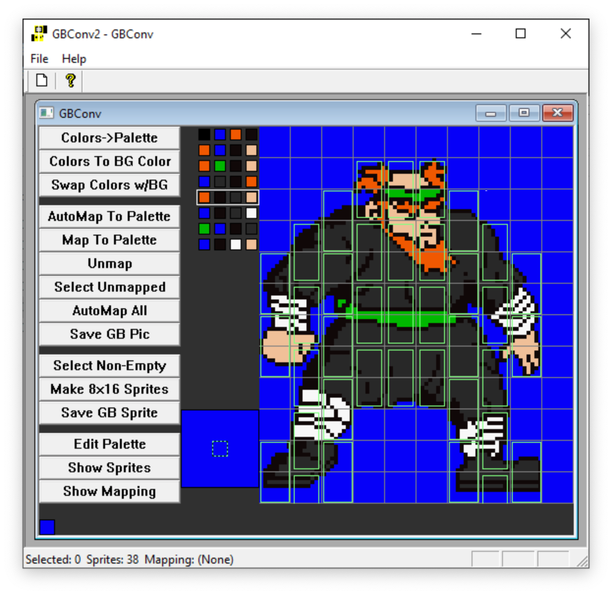

A weird and wonderful action odyssey for Game Boy Color. Developed in 2000 by Abe Pralle and Jacob Stevens. Playable and fairly complete but never finished.

About     | Current Release
----------|-----------------------
Version   | 1.1
Date      | 2020.07.05
Target    | Game Boy Color
Build     | macOS, Windows, Linux
Editors   | Windows
Licenses  | MIT (source code) and Creative Commons (IP) - see the [LICENSE](LICENSE).

## ROM
The pre-compiled FGB ROM for Game Boy Color is [here](ROMS/fgb.gb).

It can be run on emulators such as [SameBoy](https://sameboy.github.io). Note: the "battery save" feature does not seem to work correctly on SameBoy at least. Use emulator save states instead.

## Developers
- Abe Pralle (programming, level design, dialog) grew up on the Commodore 64 but was too young to develop for it. He embraced the "second chance" of creating an 8-bit game for the Game Boy Color in the late 1990's. His current passion project is a programming language called [Rogue](https://github.com/AbePralle/Rogue).
- Jacob Stevens (art, music) is a long-time Nintendo fan and similarly loved the idea of developing for Game Boy Color. These days he and his brother Paul Stevens are a dynamic duo developing games as [Riverman Media](https://rivermanmedia.com).

## Building from Source
1. Install the Rogue language from here to take advantage of the Rogo build system:
    - [https://github.com/AbePralle/Rogue](https://github.com/AbePralle/Rogue)
2. Install the RGBDS assembler:
    - [https://github.com/rednex/rgbds](https://github.com/rednex/rgbds)
3. Run `rogo` in this project's base folder.

## Tools
- Each of the following tools is provided as a precompiled Windows `exe` along with their original source code.
- These `exe` files were last compiled circa 2000. No attempt has been made to update their project source. The Level Editor and Image Converter `exe`'s are both confirmed to work on Windows 10.
- During its original development, FGB was essentially a single folder containing hundreds of files. Because of this, each tool typically expects its data files to be in the same folder as the tool itself.
- This project has now been reorganized to cleanly separate original assets, converted data, and source code into separate folders.
- As such data files will generally need to be moved into each tool folder as inputs and the results moved back to the appropriate location if the editors are used.
- Ideally at some point Abe Pralle or a contributer will update the editor projects to be in a modern Visual Studio format and adjust the input and output locations to utilize the current folder structure.

### LevelEditor

1. Refer to `Media/Levels/` to identify levels you want to edit.
2. Copy corresponding `Data/Levels/*.lvl` files to `Tools/LevelEditor`.
3. Run `Tools/LevelEditor`, load, edit, and save the levels.
4. Copy the modified levels back to `Data/Levels/`.

### GBConv2

- GBConv2 loads BMP images and converts them to tiles and/or sprites.

### Game Boy Sound Manipulator

The [Game Boy Sound Manipulator](https://github.com/AbePralle/GameBoySoundManipulator) is a tool in a separate repository that allows developers to experiment with sound parameters in real time. It was used extensively in the creation of FGB.

### MakeGBM

**MakeGBM** compiles programmatic music `.gbm` source files into data files for the FGB engine.

### MakeDiscoLights

**MakeDiscoLights** is a simple program that generates data files for the "mirror ball disco lights" of the "Duke's Disco" level.

### MapMaker

**MapMaker** reads `.lvl` data files and uses them to generate PNG images of various level and maps. All of the content it generates has already been added to this repo as `Media/Levels` and `Media/Maps`.

## Developer Notes

### Origins
1. FGB was started in 1999 by college friends Abe Pralle, Jacob Stevens, and Martin Casado (pronounced "Mar-teen"). It was very loosely based on a game called "Flour" that Martin (with input from Abe) had created. The new game was designed for Game Boy Color due to Jacob's fondness for Nintendo and so they called it "Flour Game Boy" or "FGB". Martin helped set up the initial story and the wacky world, but he soon got too busy with school and bowed out of the project.
2. FGB and Flour were both partly inspired by [Crossroads](https://lparchive.org/Computes-Gazette/Update 05/) for the Commodore 64, a type-in game that was one of the finest ever published in *COMPUTE!'s Gazette* magazine.

### Story
1. Martin's original indie game filled the title screen with flowers and then presented the game title: "Flour". It was purely a visual pun that had no bearing on the game.
2. The game was initially going to begin with the Appomattox en route to the Crouton Homeworld, the encounter with Lady Flower being attacked by the Space Gang, and landing on Planet Kiwi. The introductory sequences would all be cinematics and then upon landing on Kiwi you would immediately be able to pick any of the three playable characters at will (BA, Haiku, BS).
3. We had a good first chunk of the game implemented when we decided that we should have a prelude that introduces those main characters one at a time so players can get a feel for each of them. That's when we created the "Moon Base" levels. By that time we'd really nailed down our process and evolved our engine, so we were able to make those levels quickly and with a lot of polish and impressive features. This order of development was happenstance but it worked out beautifully. A resulting rule of thumb is: don't make the first part of the game first; make the middle part first so that you can come back and do your best work on the first part.
4. Major Skippy was originally an anthropomorphic bone with the allusion being that he was "bone-headed". The idea sounded good in theory but after the art was finished it was quickly apparent that his general shape was too phallic. We changed him to an unlit candle instead which only required changes to the top of his head in cinemas, allowing us to keep the facial expressions that had already been completed.
5. The fast-firing monkeys are a nod to the dangerous Brown Monkeys in *Crossroads I & II*, just a few of which can easily [dominate all other opponents](https://youtu.be/ibzePnoOHOQ?t=574). The leader and hero of the FGB monkeys is Duke, a one-armed orangutan.
6. The current version of the game ends on a cliffhanger as our heroes return from Space Station Apocalypse. Check out [Media/DesignDocs/TopLevelStoryScript.pdf](Media/DesignDocs/TopLevelStoryScript.pdf) to see the broad outlines of the ending we had planned.

### Technical
1. FGB has full two-player support via link cable. It is very fast, unlike the use of link cable in most Game Boy games.
2. Game Boy has famously slow link cable data transfer. The reason is that when one Game Boy transmits a byte to another over the link cable, the receiver is notified that a byte was received but there is no return acknowledgement; no way for the sender to know that the byte was received. So most games would transmit information by sending only one or a few bytes per second; a long enough interval to ensure that the other Game Boy had received each byte before sending another.
3. FGB got around this limitation by having the sender and receiver continuously swap roles and transmit single bytes to each other as fast as possible. So the sender sends a byte and then implicitly becomes a receiver and waits to receive a byte. The receiver receives a byte and then immediately acts as a sender and sends a byte back. Sender control flip-flops in this way constantly whether or not any actual data is being sent. If Abe's memory serves, a chunk of data or "message" is transmitted as a size byte and then as one byte at a time every time the control flip-flops, with the receiver implicitly collecting a set of bytes and then acting on them.
4. FGB uses a very simple but effective algorithm for generating random numbers whenever it needs them. A desktop program shuffled byte values 0-255 into a random order and then those bytes are compiled in as a look-up table. Whenever a random byte is requested, the system just reads the next byte from the table, wrapping around.
5. FGB's levels (and level editor) support a relatively sophisticated zone-based pathfinding system. The designer highlights areas of the map and can then draw paths between zones
5. digitized sound
pathfinding

### Fate
Jacob and Abe were both passionate indie game devs but had no industry contacts. They attended E3 2000 with a nice demo of FGB and pitched it to various publishers. After failing to find a publisher at E3 or over the next few months, they finally threw in the FGB towel in late 2000 or early 2001.

